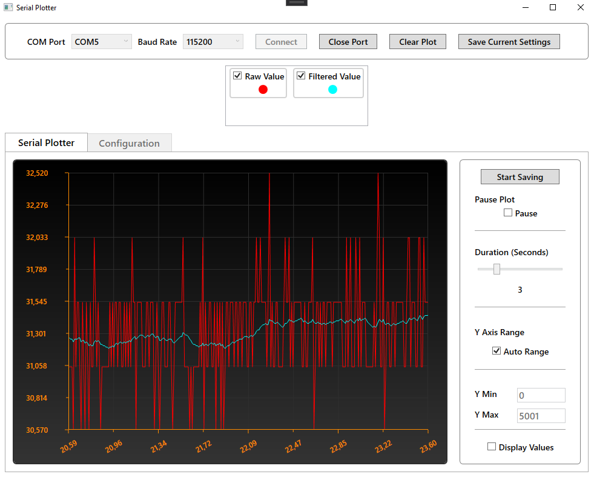
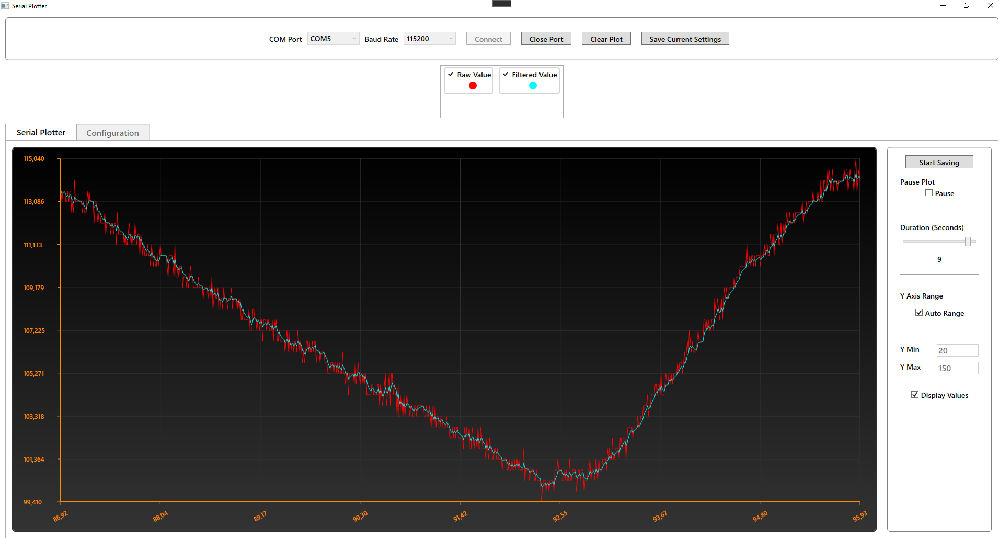

FAST KALMAN FILTER DESIGN (ONE-DIMENSIONAL) IN CPP

 Solver design especially in the computer simulation is an important matter to emulate any physical dynamical system. In order to understand the underlying mechanism of this thing, there should be a model needs to be developed in terms of differential equation and matrices equation.
 
 In this study, system dynamic library is developed in order to simulate any kinds of systems with respect to the given time parameters and system models. CPP programming language is also supported in this github repository!
 
 There are five main usage of this library:
 
 - filtering the any signal on embedded systems
 - system identification and estimation





 Basic Usage
-------------------
 
```c++

// Filter Setup

// Fast Kalman Filter Parameters
double Qparameter = 0.1;      // Covariance Process Noise Coefficient
double Rparameter = 10;       // Covariance Measurement Noise Coefficient
double samplingPeriod = 0.01; // Fixed Sampling time of System
double PNStd = 0.04;          // Initial Process Noise Deviation
double MNstd = 0.04;          // Initial Measurement Noise Deviation
double initialValue = 25;     // Known or estimated Initial Value

FastKalmanFilter SensorFilter1(Qparameter, Rparameter, samplingPeriod, PNStd, MNstd, initialValue);

...

while(true){
    ...
    filteredValue1 = SensorFilter1.GetEstimation(temp, 0.0); // Get Filtered value
    ...
}

``` 
 
For more detailed information about us,   

  http://www.phinitelab.com/
  https://www.udemy.com/user/phinite-academy/